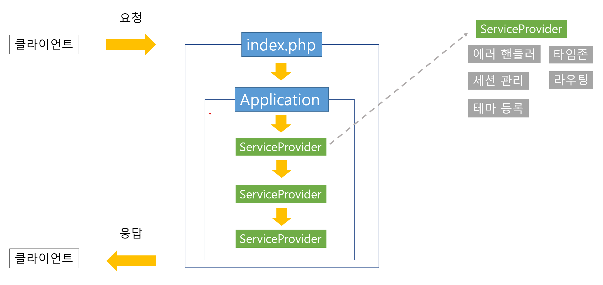

# iced-americano
PHP로 작성된 웹 서비스용 마이크로 프레임워크

# 목적
라우팅, 세션, 데이터베이스 등의 기능을 제공하는 웹 프레임워크를 PHP로 작성한다.

# 목표
- 라우팅: HTTP 요청으로부터 메서드, 경로를 추출한다. 핸들러와 미들웨어를 등록하고 실행할 수 있다.
- 데이터베이스: PDO를 이용하되, MySQL을 기본으로 한다.
- 세션: 데이터베이스를 이용하여 세션을 관리할 수 있다.
- 테마: 템플릿 엔진과 유사하게 HTML 템플릿을 선택하고 변수를 넘겨 유저에게 페이지를 보여준다.
- 모듈화: 유저가 제공한 모듈을 기반으로 웹 서비스가 동작한다.

# 구현 후 생각
이 프로젝트는 [인프런 강의](https://www.inflearn.com/course/php7-oop#reviews)를 들으면서 진행했다. 기계적인 코드 타이핑을 최대한 피했지만, 내 주도로 했다기 보다는 강의가 이끄는 방향으로 걸어간 것이다.
프로젝트를 끝낸 후, 라라벨을 써서 다른 [프로젝트](https://github.com/HaejinYang/every-discussion-backend)를 진행했다. 라라벨을 써보니, 여러가지로 프로젝트와 닮았다. 당연하게도 라라벨쪽이 훨씬 거대하고 정교하지만, 그 구조가 닮은 것이다. 그리고 이 프로젝트는 그 구조와 경향성을 놀라울 정도로 충실하게 담고 있었다. 그래서 다시 하나씩 들여다 보게 되었다.

이 프로젝트 안에는 RequestContext라는 클래스가 존재한다. 라우트를 등록하기 위한 객체이다. 어떤 요청이 가지고 있는 컨텍스트는 뭘까? 그것은 메소드, URI, 핸들러이다. 여기에 핸들러를 세분화하면 라우트 전용 핸들러와 공용 미들웨어로 나눌 수 있다. 그렇게 RequestContext는 메소드, URI, 핸들러, 미들웨어를 담아서 유저의 요청에 대한 컨텍스트를 가진 객체가 된다. 이 객체는 수동적인 것처럼 보였다. 라우터에 의하여 등록되고, 라우터에 의하여 실행되는 대상이기 때문이다. 서버가 요청을 받아 처리되는 과정까지 RequestContext는 수동적인 객체처럼 보이는 것이다.

그러나, 객체지향에서 각 객체는 능동성을 가진다. 그러니까, 라우터에 의하여 요청을 적절한 RequestContext에 부여할 수도 있지만, RequestContext가 이 요청이 내것이 맞는지 확인하는 방향을 가질 수 있는 것이다. 이 프로젝트에선 후자를 선택했다. 라우트는 RequestContext를 담아서 실행하는 역할을 할 뿐이고, 요청이 맞는지, 등록된 핸들러에 맞게 파라미터를 넘겨서 실행하는 일 등은 RequestContext가 담당한다. RequestContext가 컨텍스트를 담은 데이터 덩어리가 아니라 객체로써 역할을 다하고 있는 것이다.

수동적인 것처럼 보였던 객체의 구현은 능동적이었고, 이것이 코드에서도 잘 어울리고 코드를 진행하는데 훨씬 매끄러운 점이 재밌었다. 그래서 객체지향을 좀더 알아보고 싶었다. [객체지향의 사실과 오해](https://www.yes24.com/Product/Goods/18249021)라는 책을 읽게 되었다. 그래서 내린 결론은 [링크](https://crmerry.tistory.com/214)에 정리하였다.


# 구현 내용
## 전체 실행 흐름

클라이언트의 요청을 엔트리 포인트(index.php)에서 받아 Application을 실행한다.
Application은 프레임워크에서 제공하는 클래스로 ServiceProvider가 저장된다.
ServiceProdiver는 유저가 웹 서비스로 제공하려는 기능을 담는 클래스이다. 라우팅, 세션 관리부터 타임존 설정 등 모든 동작이 정의된다.
Application은 등록된 ServiceProvider들을 차례대로 실행하고, 클라이언트에 응답한다.
## 디렉토리 구조
```
src
    │  Application.php
    │
    ├─Database
    │      Adaptor.php
    │
    ├─Http
    │      Request.php
    │
    ├─Routing
    │      Middleware.php
    │      RequestContext.php
    │      Route.php
    │
    ├─Session
    │      DatabaseSessionHandler.php
    │
    └─Support
            ServiceProvider.php
            Theme.php
```
## 세부 사항
### 라우팅
- 디렉토리: Routing
- 파일: Route.php, RequestContext.php, Middleware.php
- 라우팅은 HTTP 요청에 대한 응답을 정의한다. HTTP 메서드, 경로, 응답 동작을 정의한 핸들러가 있다.
- 경로에는 '/post'와 같은 정적인 경로와 '/post/{id}'같은 동적인 경로가 있으므로 이를 위한 처리가 필요하다.
- `Middleware`는 여러 라우트에서 공통으로 쓸 수 있는 핸들러를 정의한 것이다. 응답을 위한 메인 핸들러가 있고, 그 전에 미들웨어들이 호출된다.
- `RequestContext`는 라우팅을 하기 위한 재료를 관리하는 단위이다.
  - `match`메서드는 비교할 URL을 인자로 받아, 현재 `RequestContext`가 담당하는 요청인지 확인한다. 그리고 매칭이 확인되면, 동적 경로에 담긴 데이터를 반환한다.
  - `runMiddleware`메서드는 등록된 미들웨어를 모두 실행한다.
- `Route`는 라우팅을 담당하는 주체이다. `RequestContext`를 이용하여 라우트를 등록하고, 실행할 수 있다.
  - `run`메서드는 HTTP 요청 정보와 등록된 라우트를 비교하여 실행한다.
  - get, post, delete 등의 HTTP 메서드와 경로를 확인하고, 동적 경로에 해당하는 데이터를 추출하여 핸들러와 함께 호출한다.
### HTTP 요청
- 디렉토리: Http
- 파일: Request.php
- 서버에 들어온 HTTP 요청을 분석하여 메서드, 경로 추출 기능을 제공한다.
### 데이터베이스
- 디렉토리: Database
- 파일: Adaptor.php
- 내부에서 PDO를 사용하여 데이터베이스에 접근하다. prepared statement를 사용하여 sql injection을 대비한다.
- `exec`메서드로 CRUD를 처리할 수 있다.
- `getAll`메서드로 테이블에서 데이터를 가져온다. 클래스를 지정하여 해당 클래스의 인스턴스로 데이터를 받아올 수 있도록 하였다.
### 세션
- 디렉토리: Session
- 파일: DatabaseSessionHandler.php
- PHP에서 세션을 위해 지원하는 SessionHandlerInterface를 상속받아 클래스를 구성했다.
- 내부에서 `Adaptor`클래스를 사용한다.
- 세션에 저장한 데이터는 데이터베이스와 연동되어 관리된다.
### 테마
- 디렉토리: Support
- 파일: Theme.php
- 템플릿 엔진처럼 미리 작성된 레이아웃을 불러와 사용할 수 있도록 구조화 했다.
- `view`메서드에서는 Variable variables($$를 이용하여 문자열을 변수 이름으로 치환하는 기법)을 사용하여 인자로 넘긴 연관 배열의 키를 레이아웃의 변수 이름으로 사용할 수 있다.
- `setLayout`메서드는 한 번 호출되어 전체 레이아웃(헤더, 네비게이션, 메인, 푸터)을 책임진다. `view`메서드에서 바뀌는 것은 메인이 될 것이다.
### ServiceProvider
- 디렉토리: Support
- 파일: ServiceProvider.php
- ServiceProvider는 유저가 서비스(서버가 실행되는 동안 진행할 로직)를 등록할 수 있도록 제공하는 껍데기이다.
- ServiceProvider는 에러 핸들링, 세션 관리, 데이터베이스 제어, 라우팅, 테마 등의 기능을 담아 Application에 제공한다.
- 최초에 abstract class였지만 내부 동작이 없기에 interface로 변경하였다.
### Application
- 디렉토리: 루트(src디렉토리)
- 파일: Application.php
- Application은 ServiceProvider를 받아 실행하는 역할이다. 
- 라우팅, 세션 관리 등은 모든 로직은 사용자가 ServiceProvider로 정의하여 Application에 등록해야 한다.

# 참고
이 코드는 [PHP 7+ 프로그래밍: 객체지향](https://www.inflearn.com/course/php7-oop#reviews)강의를 바탕으로 작성함.
